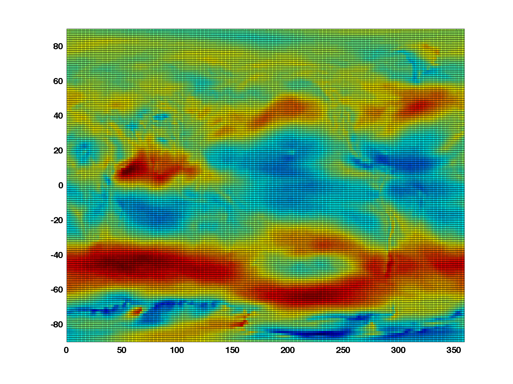

# read_grib
=========

##read_grib is a WMO GRiB Edition 1 file reader for MATLAB

Current Version: r4 (10 March 2013)

##NOTE RE: Grib2 files

read_grib does NOT read grib2 files, and there is no chance that it will. It is much easier to do one of two things:

1. Use nctoolbox, available on GitHub at https://github.com/nctoolbox/nctoolbox.git. This is the simplest way.
2. Convert grib2 to netCDF with [wgrib2](http://www.cpc.ncep.noaa.gov/products/wesley/wgrib2/) and use MATLAB's netCDF interface to get into MATLAB.

##Summary
read_grib is a WMO GRiB Edition 1 file reader for MATLAB.  It uses the binary data segment decoder from Wesley Ebisusaki's [wgrib](http://www.cpc.ncep.noaa.gov/products/wesley/wgrib.html) to decode Edition 1 grib records.  Details of the GRiB format can be found in [NCEP's Office Note 388](http://www.nco.ncep.noaa.gov/pmb/docs/on388/).  I wrote it because I needed it; feel free to use it as-is, and with no guarantee that it will work for all possible grib records.  However, for the most common model output, it seems to work well.  

If a particular grib record is problematic, please try to look at it with wgrib.  If that doesn't work (for whatever reason), then read_grib will not work either.  While all of the grib record information is read and (optionally) returned by read_grib, it is sometimes easier to use wgrib to see what is in the grib file, and then use read_grib to get data into MATLAB.  

###INSTALLATION
Pull the repo to your local machine, into a directory called read_grib.  The files can be left here and the path to read_grib included in the startup.m file.  Alternatively, get the latest zipped package [here]().

###COMPILATION
There is 1 mex file, written in c, that needs to be compiled.   Fire up
MATLAB, cd to the read_grib/private directory and type the following:

    >> mex BDS_unpack_mex5.c

All should go well, assuming you have a [MATLAB-supported c compiler](http://www.mathworks.com/support/compilers/R2013b/index.html).  This code is known to work on Linux, DEC-alpha, IBM, SGI, and MACs. The code is standard, and should work on most other platforms.  Binaries are available for some platforms, and are in the git repo.

###Usage

read_grib reads WMO international exchange GRiB formatted data files into MATLAB.  It has various input modes, including extraction of individial GRiB records by record number, extraction by parameter name (which is not unique), and generating an inventory of the GRiB file contents.  It has been tested on the following standard model output files: AVN, ETA, RUC, ECMWF, and WAM.  The default GRiB parameter table used is the NCEP Operational table.

Calls to read_grib look like:

    >> grib_struct=read_grib(gribname,irec,p1,v1,p2,v2,...);

For example:

    >> grib_struct=read_grib(gribname,irec,'HeaderFlag',0,'ParamTable','ECMWF128');

The first 2 arguments are required:

    gribname - filename containing GRiB records.
    irec - specifies which GRiB records to read.
        If irec is a vector, it specifies which GRiB records to return.
        If irec is a scalar, is specifies how far to read into the GRiB file.
        If irec==-1, read_grib reads all records(default). 
        Irec can be a CELL ARRAY of parameter names to extract.  
        Type read_grib('paramtable') for a list of parameter names. 
        Irec can also be the string 'inv{entory}', so that Read_grib prints a GRiB contents list.

There are a few optional arguments that control header reporting, data decoding, and which grib parameter table to use. 

    HeaderFlag - (0|1) report only headers if==1 (default=1) no data structures are returned unless DataFlag==1.
    DataFlag   - (0|1) return decoded BDS if==1 (default=1).  The data for the parameter is stored in the .fltarray field of the structure.
    ScreenDiag - (0|1) control diagnostics to screen (default=1)
    ParamTable - ('NCEPOPER'|'NCEPREAN'|'ECMWF128'|'ECMWF160'|'ECMWF140') selects the parameter table to use for matching kpds6 number to the correct parameter name. (default='NCEPOPER')

A different parameter table can be specificed by creating a file in the same format at the .tab files in the read_grib directory, and using the ParamTable option with the file's name. 

###Tutorial 
Pretend you have a file called anl.grb containing 37 grib records from an originating center that has output the model fields onto an equidistant lat/lon grid. 

To inventory the file:

    >> gribFileName='anl.grb';
    >> grib_struct=read_grib(gribFileName,'inv');

To decode (extract) the 3rd and 7th grib records:

    >> grib_struct=read_grib(gribFileName,[3 7])

To decode (extract) all grib records:

    >> grib_struct=read_grib(gribFileName,-1);

Each record that is extracted is returned as a structure in the grib_struct variable.  In the last case above, the grib_struct variable is of length 37 (there are 37 records in this grib file), with structure fields for all parts of the grib record. 

    >> grib_struct                                     
    grib_struct = 
    1x37 struct array with fields:
        sec1_1
        lengrib
        edition
        file
        record
        description
        parameter
        layer
        units
        stime
        level
        gridtype
        pds
        gds
        bms
        bds
        fltarray

The actual data for a decoded record is in the **fltarray** field of each structure.  So, according to the inventory, the 850 mb ugrd data is in grib_struct(31).fltarray.  The date for this data is grib_struct(31).stime, in this case the date is June 01, 1990. More detailed date/time is in the product description segment (pds).

    >> dn=datenum(grib_struct(31).pds.year,grib_struct(31).pds.month,grib_struct(31).pds.day,grib_struct(31).pds.hour,grib_struct(31).pds.min,0);
    >> datestr(dn,31)
    ans =
    1990-06-01 00:00:00

###Dealing with the horizontal grid
Dealing with the horizontal (spatial) grid for grib files is usually the hardest part. The grib_struct field grid definition segment (gds) contains the description of the spatial grid parameters. Some grids (like equidistant cylinders) are easy to reconstruct.  (Some grids like NCEP's lambert or gaussian grids are not easy to reconstruct; fortunately many grib originators publish the grid coordinates for these types of grids.)

The grid in these gribs is an equidistant cylindrical lat/lon grid:

    >> grib_struct(31).gridtype
    ans =
    Equidis. Cyl. Lat/Lon

According to the gds, it is a 1.25 degree global grid (note the Di, Dj, La1,Lo1, La2,Lo2 field values):

    >> grib_struct(31).gds 
    ans = 
          len: 32
           NV: 0
           PV: 255
          DRT: 'Equidis. Cyl. Lat/Lon'
           Ni: 288
           Nj: 145
          La1: 90
          Lo1: 0
          rcf: 128
          La2: -90
          Lo2: -1.2500
           Di: 1.2500
           Dj: 1.2500
          smf: 0
    oct29to32: [4x1 double]
      gdsvals: [32x1 double]

The spatial grid is then just 

    >> gds=grib_struct(31).gds;
    >> lon=gds.Lo1:gds.Di:gds.Lo2+360;
    >> lat=gds.La1:-gds.Dj:gds.La2;

Note that there is a bit of manipulation of the grid parameters to get the coordinate vectors to be correct (Lo2+360, -gds.Dj).  Then, just reshape the fltarray vector to this size, plot it to make sure the landmasses are where they should be.  If not, then there probably needs to be a transpose in the reshape. 

    >> ThisUgrd=reshape(grib_struct(31).fltarray,gds.Ni,gds.Nj)';
    >> pcolor(lon,lat,ThisUgrd)
    >> % draw some coastline, etc... 

You should get something like this:

Then, just use standard interp2 to sample at specific locations, etc ...

Some gribs, such as from  NCEP operational model output, are on unequally spaced grids (e.g., Lambert Conformal or Gaussian).  NCEP uses many different output grids; some of these grids' lat/lon coordinates are posted [here](http://ftp.emc.ncep.noaa.gov/mmb/mmbpll/gridlola.eta/).

